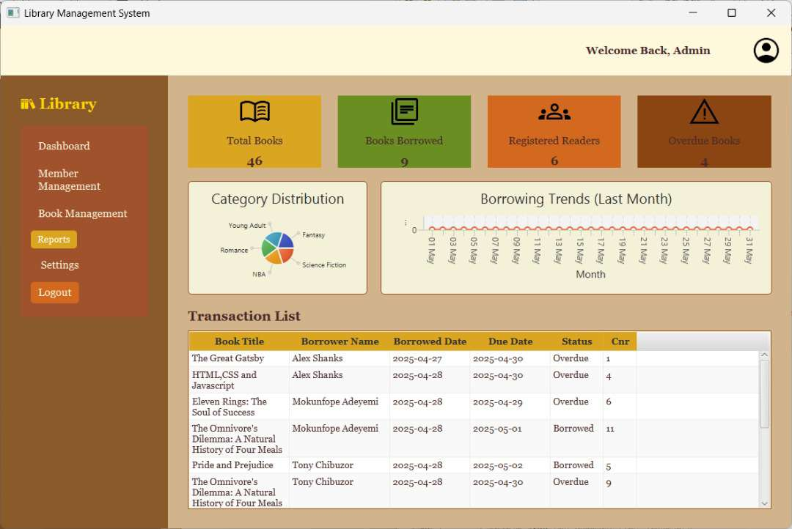

# 📚 Library Management System

The **Library Management System** is a software application designed to manage the daily operations of a library efficiently. It enables librarians to manage books, members, and lending activities, while providing students with easy access to library resources.

## 🛠️ Features

### 🔐 User Roles

- **Admin (Librarian):**

  - Manage books (Add, Edit, Delete)
  - Register and manage student accounts
  - Issue and receive books
  - View all student borrowing history
  - View defaulters (late returners)

- **Student:**
  - View available books
  - View their borrowing history
  - Request books (optional if implemented)

### 📦 Book Management

- Add new books with details:
  - Title
  - Borrower Name
  - Borrower Date
  - Due ate
  - Status
- Edit or delete book entries
- Track available vs issued copies

### 👤 Student Management

- Register new students
- Edit student details
- View borrowing history per student

### 📖 Borrowing & Returning

- Issue books to students
- Record return of books
- Calculate and display late returns (with due date comparison)

### 📅 Borrowing Rules

- Each student is allowed up to **3 books at a time**
- Borrowing period: **14 days**
- Defaulters list generated based on overdue books

## 🗂️ Technologies Used

- **Frontend:** Java, CSS
- **Backend:** Java
- **Authentication:** Session-based login system

## 📸 Screenshots

### 🔐 Member Management


### 📚 Reports



### Dashboard


### Settings


## 🧪 Setup Instructions

```bash
# 1. Clone the repository
git clone https://github.com/Onunkwor/Library-Management-System-LMS-.git
cd Library-Management-System-LMS-

# 2. Open the project in your Java IDE (e.g., IntelliJ IDEA, Eclipse, or NetBeans)

# 3. Configure the MySQL database
# - Create a new database (e.g., 'library_db')
# - Run the provided SQL schema to set up tables
# - Update DB connection details in your Java config file (e.g., DB URL, username, password)

# 4. Compile and run the application
# - Use your IDE's run button or build a JAR file and run:

java -jar LibraryManagementSystem.jar

```
